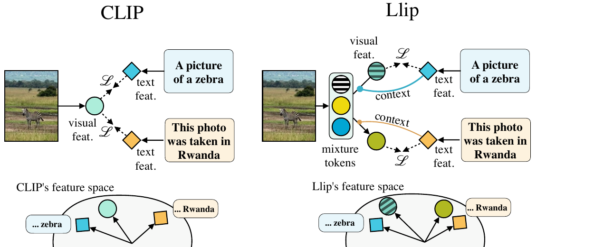
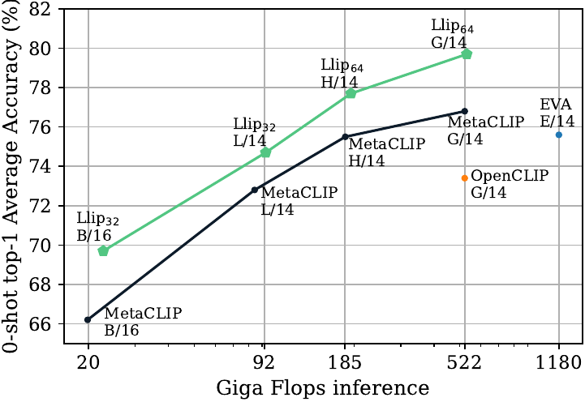

# Modeling Caption Diversity in Contrastive Vision-Language Pretraining

Samuel Lavoie, Polina Kirichenko*, Mark Ibrahim*, Mido Assran, Andrew Gordon Wilson, Aaron Courville, Nicolas Ballas

\* Equal contribution

[[paper]](https://arxiv.org/abs/2405.00740)[[bibtex]](https://github.com/lavoiems/llip_readme/blob/master/README.md#citing-llip)

Pytorch implementation and pretrained models for Llip.
Llip produces strong image-text retrieval models and image and text encoders.
The models are pre-trained on a dataset with 2.5B image-caption pairs
and can contextualize the visual features on target captions.

<p float="left">
  
   
</p>


## Pretrained models
PyTorch implementation and pre-trained models for Llip.
Pre-trained models


|   Backbone    | \# Mixture tokens | Avg ZS Acc. |  Download  |
| ------------- | -------------     | ----------- |  --------  |
|   ViT-B/16    |        32         |   69.6      |  [[Model]](https://dl.fbaipublicfiles.com/llip/llip_b16_k32.pt) |
|   ViT-G/14    |        64         |   79.3      |  [[Model]](https://dl.fbaipublicfiles.com/llip/llip_G14_k64.pt) |


## Installation

The training and evaluation code requires PyTorch and several other packages. We provide a requirements.txt file to install the python packages necessary for reproducing the pre-training and the evaluation of Llip. We recommend the use of python 3.10 and cuda 12.1.

To install the packages along python 3.10 using a conda environment, please execute the following command:

```
conda create --name llip python=3.10
conda activate llip
pip install -r requirements.txt
```

## Code structure
All experiments are defined via configs.
The configs for Llip can be found in [`llip/run_configs/llip.py`](llip/run_configs/llip.py)
```
config_evals/          # Config folders for the evals
evals/                 # Folder with the evals
llip/
----| run_configs/     # Config folder with the model configs
----| open_clip/       # OpenCLIP's utility
----| training/        # Utility for training
----| main.py          # Main entry point
submitit_openclip.py   # Submitit script for running on SLURM
```

## Training
Reproducing the models requires the MetaCLIP dataset which is not publicly available.
However, we found Llip to improve the performance with other datasets such as LAION.
This codebase supports loading webdatasets.

To train a model, please modify one of the config found in [`llip/run_configs/llip.py`](llip/run_configs/llip.py)
and set the following arguments:
* train_data: Location to your dataset (can be a webdataset)
* logs: Location when the logs and the models checkpoints will be saved

**Running locally**

Simply execute the following command where <config_name> is the name of the config defined as the name
of the function in [`llip/run_configs/llip.py`](llip/run_configs/llip.py) (e.g. `llip_b16`)
```
python -m llip.main <config_name>
```

**Run on SLURM with submitit**
The codebase also supports running on SLURM using [submitit](https://github.com/facebookincubator/submitit).
The number of GPUs and the number of nodes used
for the training are defined in the model config.

For example, we can launch a training run on slurm with the following command where <config_name> is the name
of the model config in [`llip/run_configs/llip.py`](llip/run_configs/llip.py) (e.g. `llip_b16`)
```
python submitit_openclip.py <config_name>
```

## Zero-shot evaluation

The evaluations use a dataset catalog to fetch the location of the datasets and other metadata
related to the evaluation dataset. To run the evaluation, please modify the dataset catalog found
at `llip/clipeval/dataset_catalog.json` with the datasets that are on your cluster.

The evaluation script can be launched by using the following command:
```
python -m evals.main_mc --fname configs_evals/llip_b16_k32.yaml
```

## License
See the [LICENSE](./LICENSE) file for details about the license under which this code is made available.

## Citing Llip
If you find this repository useful in your research, please consider giving a star ⭐ and a citation
```
@inproceedings{lavoie2024modeling,
  title={Modeling Caption Diversity in Contrastive Vision-Language Pretraining},
  author={Samuel Lavoie and Polina Kirichenko and Mark Ibrahim and Mido Assran and Andrew Gordon Wilson and Aaron Courville and Nicolas Ballas},
  booktitle={Forty-first International Conference on Machine Learning},
  year={2024},
  url={https://openreview.net/forum?id=iaV2fU6Dif}
}
```
